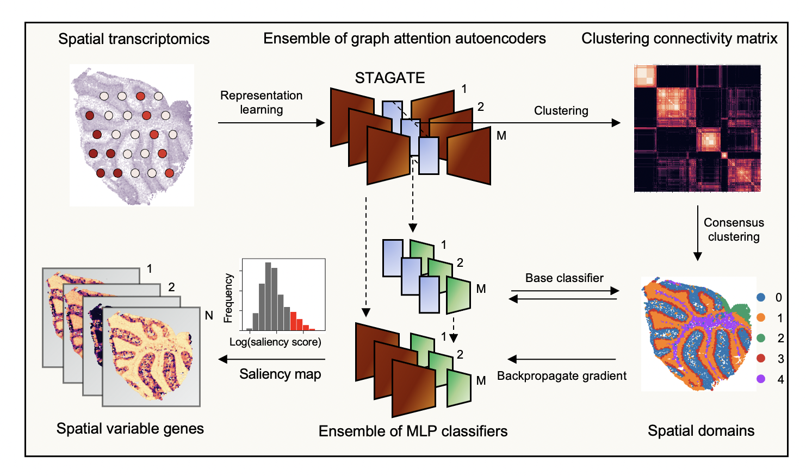

# STAMarker: Determining spatial domain-specific variable genes with saliency maps in deep learning
# Overview
STAMarker is a three-stage framework that consists of an ensemble of graph attention autoencoders (STAGATE), an ensemble of MLP classifiers and saliency maps computation by the backpropagated gradient.

 Given the spatial transcriptomics of a tissue section, STAMarker first trains an ensemble of graph attention auto-encoders that consists of M STAGATE models to learn the low-dimensional latent embeddings of spots, cluster them to obtain M grouping results, computes the clustering connectivity matrix and applies hierarchical clustering to obtain the spatial domains. STAMarker further models the relationships between the embeddings of the M auto-encoders and the spatial domains by training M base classifiers. At last, STAMarker computes the saliency map by first stacking the encoder and the corresponding classifier and then backpropagating the gradient to the input spatial transcriptomics matrix. STAMarker selects the domain-specific SVGs based on the genes’ saliency scores in each spatial domain.

## Usage
The pipeline of STAMarker is wrapped in the core class `STAMarker`.
```python
from stamarker.dataset import SpatialDataModule
from stamarker.pipeline import STAMarker, make_spatial_data
from stamarker.utils import select_svgs
# Make data module from `ann_data` where `ann_data` is an scanpy `AnnData` object of spatial transcriptomic dataset.
data_module = make_spatial_data(ann_data)
# Prepare data: filter out spots and genes and initialize the spot-spot graph
data_module.prepare_data(rad_cutoff=40, n_top_genes=3000, min_counts=20)
```
Now we are ready to run STAMarker stages by stages.
``` python
# Initialize the `STAMarker` class
n_auto_encoders = 20
stamarker = STAMarker(n_auto_encoders, "output_folder", config)
# Stage1: train the graph attention auto-encoders and save the model to `output_folder`
stamarker.train_auto_encoders(data_module)
# Stage2: cluster the spots by the learned emebeddings and perform consensus clustering 
n_class = 5
resolution = 0.6
stamarker.clustering(data_module, "louvain", resolution)
stamarker.consensus_clustering(n_class)
# Stage3: train the classifiers based on the consensus labels
stamarker.train_classifiers(data_module, n_class)
``` 
We can get the saliency maps by the following code
``` python
smaps = stamarker.compute_smaps(data_module)
consensus_labels = np.load(stamarker.save_dir + "/consensus_labels.npy")4
```
Select the spatial domain-specific SVGs of spatial domain 0 by one line.
```python
svg_domain0 = select_svgs(smaps, 0, consensus_labels, alpha=1.5)
```
## Tutorial
- [T1 Mouse cerebellum dataset](./tutorial/App-%20mouse-%20cerebellum.ipynb)

## Contact
If you have any problem regarding STAMarker， please contact zhangchihao11@outlook.com.

